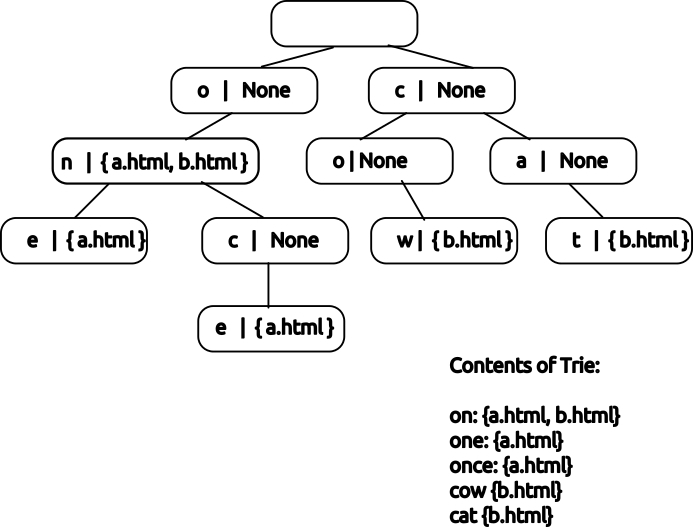

# Search Trie project
For this project I will crawl web pages, storing the resulting text in a special data structure known as a trie and using it to implement a search interface.  

Step 1: Write a Trie  data type for use in search.  
Step 2: Implement a web crawler, which will populate my Trie.  
Step 3: Implement a terminal interface using rich.


## Execution Plan:
### By the end of Week 4:
1. Complete the `character_to_key` function and write tests to verify its correctness.  
2. Ensure the function handles all specified cases (lowercase, uppercase, special characters).
### By the end of Week 5:
1. Implement the Trie class with all required methods and the `wildcard_search` function.  
2. Write tests to verify the trie's functionality, including edge cases.
### By the end of Week 6:
1. Build the web crawler to collect words from specified URLs and populate the trie.  
2. Test the crawler to ensure it respects `max_depth` and avoids infinite loops.  
### By the end of Week 7:
1. Implement the search interface (terminal or web) to query the trie and display results.  
2. Ensure the interface is user-friendly and supports continuous searching.  
### By the end of Week 8:
1. Conduct final testing and refine the system for performance and usability.  
2. Add error handling and user-friendly messages.  
3. Prepare the project for submission.  


## Implementation:

For this project I implemented crawling web pages, storing the resulting text in a special data structure known as a **trie** and using it to implement a search interface.

- Week 4: Write a helper function and some basic tests.
- Week 5 & 6: Write a `Trie` data type for use in search.
- Week 7 & 8: Implement a web crawler, which will populate my `Trie`.
- Week 9: Implement a search interface, using a library of my choosing.

FYI: A trie is a special type of search tree that efficiently represents string keys with common prefixes.

My trie will associate words found on pages with the URLs they were found on:



(This image shows the keys as letters as shorthand, in practice my Trie will store keys using integer array positions.)

### Week 4 - `character_to_key`

My `Trie` will require me to convert individual characters into numeric keys.

I use the following rules for my purposes:

- Keys will be treated as if they are made of lower case characters and `_`.
- Characters correspond to the numeric values 0-26, with 'a' = 0, 'z' = 25, and '_' = 26.
- A-Z will be treated as 0-25, identical to their lower case form.
- Any other character (such as a number or punctuation) will correspond to 26/'_'.

I consider using the [`ord`](https://docs.python.org/3.11/library/functions.html#ord) function which can convert characters to integer representations.

Also I wrote several tests covering its behavior in `test_character_to_key.py`. 

I can run my tests via `uv run pytest trie_search/test_character_to_key.py`

## Week 5 & 6 - Trie

I will implement a class `Trie` that will associate strings with values.

To design the `Trie`, it is 

- a `abc.MutableMapping`, which requires:
    - `__getitem__`
    - `__setitem__`
    - `__delitem__`
    - `__iter__`
    - `__len__`
- implement a method `wildcard_search(s: str) -> Iterable[tuple[str, Any]]` that allows fuzzy searching for strings.

FYI: Both `wildcard_search` and `__iter__` will return an iterable. I choose to return a generator (by using use `yield`).
All the classes and functions are implemented in `trie.py`.

I can run my tests via `uv run pytest trie_search/test_trie.py`

## Week 7 & 8 - Web Crawler

I will build a web crawler that gathers all of the words on a website and uses my `Trie` to make them searchable.

I write all helper functions in `utils.py`, and will write my solution in `crawler.py`.

### `utils.py`

It contains:

`ALLOWED_DOMAINS` - To ensure that my crawler doesn't visit sites outside the scope. This is a tuple of strings of testing domains. Passing a domain that does not start with one of these to `fetch_html` will result in an error. I will need to filter the links I find using this tuple to avoid traversing to a forbidden page.

`fetch_html(html: str) -> str` - Fetches the raw HTML for a given website. The function will raise `FetchException` if an error is encountered (such as an invalid domain).

`get_links(html: str, source_url: str) -> list[str]` - Given a string of HTML, returns all URLs linked to from that page.

`get_words(html: str) -> text: str` - Given a string of HTML returns just the text on the page with no HTML tags left in.

### `crawler.py`

I will implement the following two functions within `crawler.py`:

### `crawl_site(start_url: str, max_depth: int) -> dict[str, list[str]]`

This function takes a starting URL and a maximum depth, and will begin a crawl collecting the words that appear on each page.

If `max_depth` is 0, no links should be followed.
Links from the starting page are considered depth=1, and links from those pages would be depth=2, and so on. My code should only crawl as deep as links of the specified `max_depth`.

If `max_depth=1` this would also crawl all links that appear on the starting page.

**My code must avoid visiting the same page twice. It is possible, even common, for pages to link back to the page that I have already visited. My code must take care to avoid this, or it is likely to get stuck in infinite loops.**

The return value is a mapping of URLs to the words that appeared on that page.

### `build_index(site_url: str, max_depth: int) -> Trie`

`build_index` will use the words gathered by `crawl_site` to build a search index.

It should return a `Trie` where the keys are words seen on the crawl, and the value associated with each key is a set of URLs that word
appeared on.

### Example

Imagine a site with three very simple pages:

```html
<!-- index.html -->
<html>
  <a href="one.html">one</a>
  <a href="two.html">two</a>
  <p>this is the index page</p>
</html>
```

```html
<!-- one.html -->
<html>
  <a href="index.html">home</a>
  <p>page one | australia</p>
</html>
```

```html
<!-- two.html -->
<html>
  <a href="index.html">home</a>
  <p>page two | new zealand</p>
</html>
```

My `Trie` would contain:

| word | urls |
|-|-|
| one | {index.html, one.html} |
| two | {index.html, two.html} |
| this | {index.html}
| is | {index.html}
| the | {index.html}
| index | {index.html}
| page | {index.html, one.html, two.html} |
| home | {one.html, two.html}
| australia | {one.html} |
| new | {two.html} |
| zealand | {two.html} |

### Tips

I can run these tests with `uv run pytest trie_search/test_crawler.py -x`

I should probably run these tests with `-x` so that if a test fails I do not continue. It is probably easiest to get the tests running in the order provided.

I may also find `-k` useful, `-k example` for instance, will only run tests that include "example" in their name, which will avoid running the (slower/more complicated) parks tests until I am ready. I can also specify a full test name, so `-k build_index_parks` will just run that final test.

Additionally, I will note that these tests make real web requests. They can be slow and in rare cases I may get a connection error unrelated to my code (if so try again).

## Part 3 - Search Interface

For this final portion of the assignment, I will build a small interface to my search index.

### Requirements

For this assignment I need to create an interface that achieves the following:

- When the program starts it should crawl the given URL, building a `Trie` using the methods defined in earlier parts.
- Once the crawl is complete, a search box should be available, prompting the user to enter text.
- Typing a query into the search box should execute a search against the `Trie`.
  - The results should be displayed in two columns: the word that matched followed by one entry per page.
  - If there are no results, a message stating so should be displayed.
- It should be possible to continue to search indefinitely.

Beyond these requirements, my implementation is up to me.

I won't have automated tests for this portion, instead I will run one of the commands below & use my application.

### Option A: Terminal Interface using Rich

I have seen the `rich` library used on prior assignments to build "TUI", terminal user-interfaces.

TUIs are a useful solution for small tools that can be used to automate common tasks or provide an interface to various libraries or APIs.

If I go this route:

- Be sure to `uv add rich` & check in the changes to `pyproject.toml` and `uv.lock`.
- Write my application in `trie_search/tui.py`, making it runnable via `uv run python -m trie_search.tui`.
- I may want to look at the code from the card game problem for guidance.

I will want to read the following pages to get started:

- <https://rich.readthedocs.io/en/stable/introduction.html>
- <https://rich.readthedocs.io/en/stable/prompt.html>
- <https://rich.readthedocs.io/en/stable/columns.html>
- <https://rich.readthedocs.io/en/stable/tables.html>

Also take advantage of the `rich` code that's already been shared on prior assignments (the card game in particular)
but be sure to turn in *my own code*.

### Option B: Web Interface using Flask

If I'd like to try something different, I may instead create a `Flask` application.

If I go this route:

- Be sure to `uv add flask` & check in the changes to `pyproject.toml` and `uv.lock`.
- Write my application in `trie_search/web.py`, making it runnable via `uv run flask --app trie_search.web run`.
- My application should present the search interface on the "/" route, so navigating to `localhost:5000` will allow the interaction described in the requirements. (I may add any other routes I wish.)

I will want to read the following to get started:

- <https://flask.palletsprojects.com/en/stable/quickstart/#a-minimal-application>

Once I hit the section **File Uploads** I can stop, nothing below that section should be needed for this assignment.
